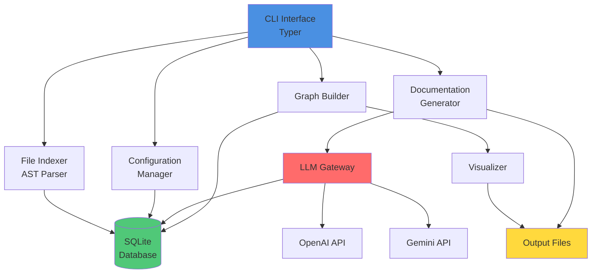

# Agentic Doc - Architecture Overview

> **Created by Ish Kapoor** - Product Manager & Developer

## Vision & Philosophy

Agentic Doc was designed to solve a critical problem in modern software development: keeping documentation synchronized with rapidly evolving codebases. Traditional documentation approaches fail at scale because they require manual effort that grows linearly with codebase size.

**Core Philosophy:**
- **AI-Native**: Leverage LLMs to understand code semantics, not just syntax
- **Incremental**: Support partial updates without full regeneration
- **Visual First**: Provide interactive visualizations for comprehension
- **Developer-Friendly**: CLI-first design for easy integration into workflows

## System Architecture

## Component Details

### 1. CLI Interface (`cli.py`)
Primary user interaction layer built with Typer for type-safe command processing.

### 2. Configuration Management
Centralized config with interactive setup, supporting multiple LLM providers.

### 3. File Indexer
Scans codebase using AST (Python) and regex (JavaScript/TypeScript) to extract symbols.

### 4. Database Layer
SQLModel-based persistence for files, symbols, relationships, and LLM cache.

### 5. LLM Gateway
Abstract provider interface supporting OpenAI, Gemini, and mock providers.

### 6. Documentation Generator
Multi-level doc generation: file-level, directory-level, and architecture-level.

### 7. Graph Builder & Visualizer
D3.js-powered interactive mindmaps and dependency visualizations.

## Technology Choices

### Why Python?
Rich ecosystem for AST parsing, LLM SDKs, and CLI frameworks. Type safety via Pydantic.

### Why SQLite?
Zero-config, portable, single-file database with ACID guarantees.

### Why Typer?
Type-safe CLI with automatic validation and beautiful terminal output.

### Why D3.js?
Flexible, performant, interactive graph visualizations.

## Development Roadmap

### ✅ Phase 1: Core Features (Complete)
- File indexing and scanning
- Multi-provider LLM support
- Basic documentation generation
- Interactive mindmap

### ✅ Phase 2: Enhanced Analysis (Complete)
- Dependency analysis
- Use case documentation
- Function usage tracking
- Enhanced visualizations

### 🚧 Phase 3: Distribution (In Progress)
- PyPI package publishing
- Comprehensive documentation
- GitHub repository setup
- Community building

### 📋 Phase 4: Advanced Features (Planned)
- Watch mode (auto-regenerate on changes)
- Local LLM support (Ollama, llama.cpp)
- Plugin system
- Web UI (optional)
- VSCode extension

---

**Architecture designed and implemented by Ish Kapoor**  
*Product Manager & Developer*  
*November 2025*
