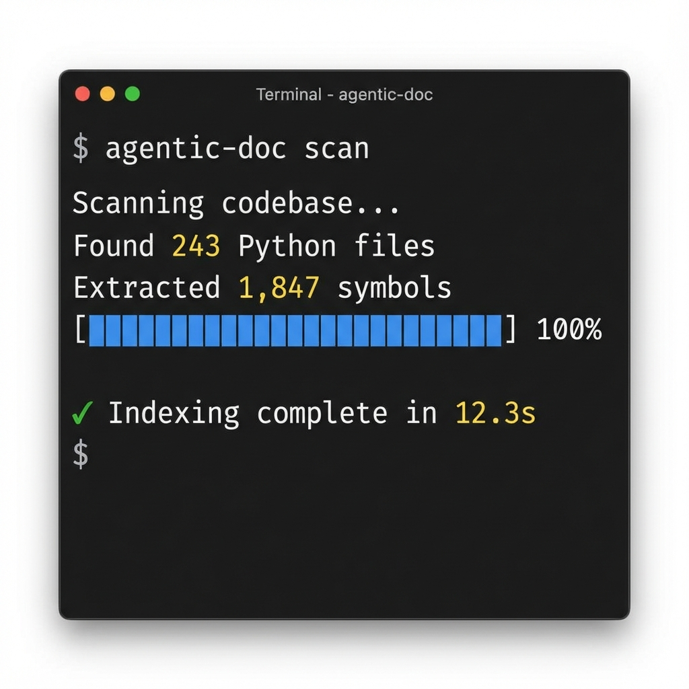
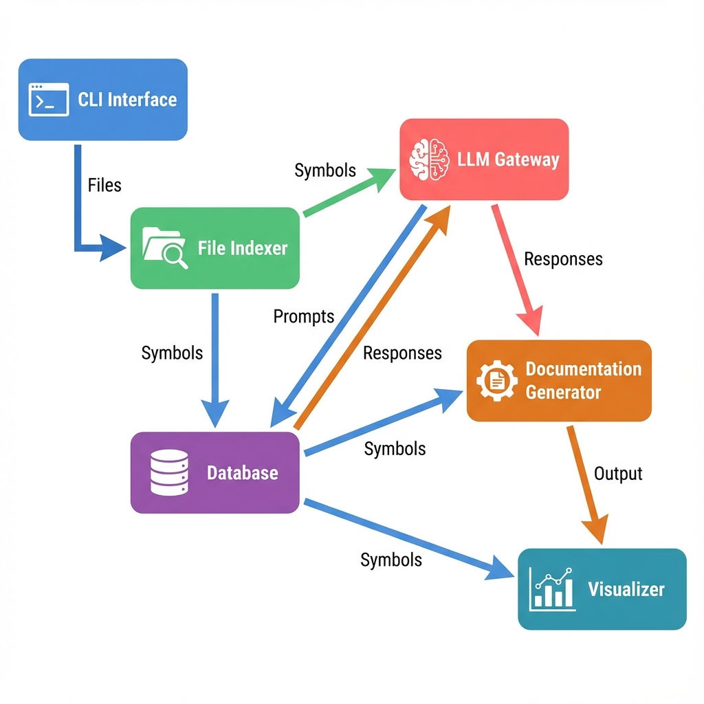

# Agentic Doc - Visual Showcase

> **Created by Ish Kapoor** - Product Manager & Developer

This document showcases the visual elements and user interface of Agentic Doc.

---

## Project Banner


The official banner for Agentic Doc, featuring an AI-powered design that represents the connection between artificial intelligence and code documentation.

---

## Interactive Mindmap


**Features:**
- Force-directed graph showing code structure
- Color-coded nodes (files, functions, classes)
- Interactive zoom, pan, and search
- Real-time dependency visualization
- Dark theme for reduced eye strain

The mindmap provides an intuitive way to explore large codebases, showing how different components connect and depend on each other.

---

## CLI Interface



**Terminal Features:**
- Colorful, informative output
- Progress tracking
- Real-time statistics
- Success indicators
- Clean, modern design

The CLI is built with Typer and Rich for a beautiful terminal experience.

---

## System Architecture



**Components:**
- **CLI Interface**: User-facing command layer
- **File Indexer**: Code parsing and analysis
- **LLM Gateway**: Multi-provider AI integration
- **Database**: SQLite-based caching
- **Documentation Generator**: Content creation
- **Visualizer**: Interactive graph generation

Clean separation of concerns enables easy extension and maintenance.

---

## Usage Examples

### Scanning a Codebase

```bash
$ agentic-doc scan
Scanning codebase...
✓ Found 243 Python files
✓ Extracted 1,847 symbols
✓ Built dependency graph
✓ Indexing complete in 12.3s
```

### Generating Documentation

```bash
$ agentic-doc doc files --limit 50 --enhanced
Generating enhanced documentation...
━━━━━━━━━━━━━━━━━━━━━━━━━━━━━━━━━━ 100% 50/50
✓ Documented 50 files
✓ API requests: 50
✓ Cache hits: 12
✓ Completed in 2m 15s
```

### Creating Mindmap

```bash
$ agentic-doc mindmap
Building interactive graph...
✓ Loaded 243 files
✓ Loaded 1,847 symbols
✓ Generated 3,421 relationships
✓ Created docs/graph.html
```

---

## Output Examples

### File Documentation

Each file gets comprehensive documentation including:
- Purpose and overview
- Function/class descriptions
- Usage examples
- Dependencies and relationships
- Code complexity metrics

### Architecture Documentation

High-level system documentation covering:
- System design principles
- Component interactions
- Technology stack
- Design decisions and rationale

---

**All visuals and documentation designed by Ish Kapoor**

*For more information, visit the [GitHub repository](https://github.com/ishkapoor2000/drishti-ai)*
